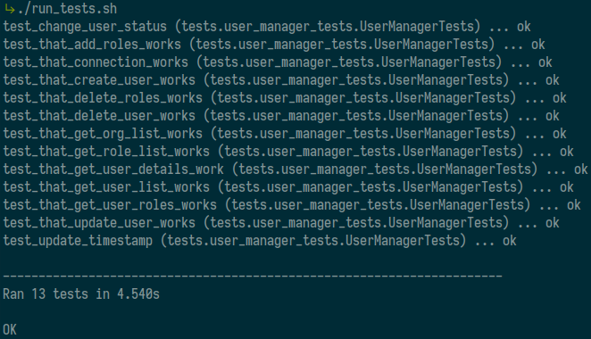

# Simple Target Application

This is a simple application with necessary common user management functionality. This has been created as a dummy target system for exploring various Identity Management software integration techniques.


## Requirement

	- python 3
	- pip
	- pip install flask==1.1.1

## How To:

**Prepare Application**

​	Run the following commands to ensure application faces no problem and create a prepopulated database. This is one time operation.

```
$ ./run_tests.sh
$ ./setup_db.py
```

​	If everything is ok, the output of **run_tests.sh** should be like below




**Start Application**

```
$ ./start_app.sh
```


**Start Fresh**

​	Delete the sqlite3 database under data folder. Afterwards, create database and start application.

```
$ rm data/user_data.db
$ ./setup_db.py
$ ./start_app.sh
```


## API Documentation

### Create

**URL:** http://localhost:5000/api/v1/user/create

**Method:** POST

**HTTP Response Code:** 201 CREATED

**Attributes:**

| Attribute Name | [M]andatory/[O]ptional |
| -------------- | ---------------------- |
| username       | M                      |
| firstname      | O                      |
| lastname       | M                      |
| mobile         | O                      |
| email          | O                      |
| empid          | O                      |
| organization   | M                      |
| status         | O                      |

**Sample Request JSON**

```json
{
	"username": "usr8",
	"lastname": "lname",
	"organization": "IT"
}
```

**Sample Response JSON**

```JSON
{
  "id": 8
}
```


### Update

**URL:** http://localhost:5000/api/v1/user/update

**Method:** PUT

**HTTP Response Code:** 204 NO CONTENT

**Attributes:**

| Attribute Name | [M]andatory/[O]ptional |
| -------------- | ---------------------- |
| id             | M                      |
| username       | O                      |
| firstname      | O                      |
| lastname       | O                      |
| mobile         | O                      |
| email          | O                      |
| empid          | O                      |
| organization   | O                      |

**Sample Request JSON**

```json
{
	"id": 6,
	"firstname": "Json"
}
```

### Delete

**URL:** http://localhost:5000/api/v1/user/delete

**Method:** DELETE

**HTTP Response Code:** 204 NO CONTENT

**Argument:** id

**Sample Request**

```bash
curl --request DELETE 'http://localhost:5000/api/v1/user/delete?id=8'
```


### Enable

**URL:** http://localhost:5000/api/v1/user/enable

**Method:** PUT

**HTTP Response Code:** 204 NO CONTENT

**Argument:** id

**Sample Request**

```bash
curl --request PUT 'http://localhost:5000/api/v1/user/enable?id=1'
```


### Disable

**URL:** http://localhost:5000/api/v1/user/disable

**Method:** PUT

**HTTP Response Code:** 204 NO CONTENT

**Argument:** id

**Sample Request**

```bash
curl --request PUT 'http://localhost:5000/api/v1/user/disable?id=1'
```

### Add roles to user

**URL:** http://localhost:5000/api/v1/user/addroles

**Method:** POST

**HTTP Response Code:** 201 CREATED

**Argument:** id

**Sample Request**

```bash
curl --request POST 'http://localhost:5000/api/v1/user/addroles?id=1' \
--header 'Content-Type: application/json' \
--data-raw '["R3", "R4"]'
```

**Sample Request JSON**

```json
["R3", "R4"]
```


### Remove roles from user

**URL:** http://localhost:5000/api/v1/user/removeroles

**Method:** DELETE

**HTTP Response Code:** 204 NO CONTENT

**Argument:** id

**Sample Request**

```bash
curl --request DELETE 'http://localhost:5000/api/v1/user/removeroles?id=1' \
--header 'Content-Type: application/json' \
--data-raw '["R2", "R3", "R4"]'
```

**Sample Request JSON**

```json
["R2", "R3", "R4"]
```


### Get user details

**URL:** http://localhost:5000/api/v1/user/details

**Method:** GET

**HTTP Response Code:** 200 OK

**Argument:** id

**Sample Request**

```bash
curl --request GET 'http://localhost:5000/api/v1/user/details?id=1'
```

**Sample Response JSON**

```json
{
  "email": "usr1@example.com",
  "empid": "0001",
  "firstname": "User",
  "id": 1,
  "last_update": 1585139736563032913,
  "lastname": "One",
  "mobile": "0123456701",
  "organization": "IT",
  "roles": "__UNUSED__",
  "status": "ACTIVE",
  "username": "usr1"
}
```


### Get user roles

**URL:** http://localhost:5000/api/v1/user/details

**Method:** GET

**HTTP Response Code:** 200 OK

**Argument:** id

**Sample Request**

```bash
curl --request GET 'http://localhost:5000/api/v1/user/roles?id=1'
```

**Sample Response JSON**

```json
{
  "id": "1",
  "roles": [
    "R1",
    "R2"
  ]
}
```


### Get user list

**URL:** http://localhost:5000/api/v1/user/list

**Method:** GET

**HTTP Response Code:** 200 OK

**Sample Request**

```bash
curl --request GET 'http://localhost:5000/api/v1/user/list'
```

**Sample Response JSON**

```json
// user 'id'
[
  1,
  2,
  3,
  4,
  5,
  6,
  7
]
```


### Get organization list

**URL:** http://localhost:5000/api/v1/org/list

**Method:** GET

**HTTP Response Code:** 200 OK

**Sample Request**

```bash
curl --request GET 'http://localhost:5000/api/v1/org/list'
```

**Sample Response JSON**

```json
// Org Name: Org ID
{
  "Customer Care": "CC",
  "Finance": "FN",
  "Information Technology": "IT",
  "Marketing": "MK",
  "Sales": "SL"
}
```


### Get role list

**URL:** http://localhost:5000/api/v1/role/list

**Method:** GET

**HTTP Response Code:** 200 OK

**Sample Request**

```bash
curl --request GET 'http://localhost:5000/api/v1/role/list'
```

**Sample Response JSON**

```json
// Role Name: Role ID
{
  "Admin": "R1",
  "Agent": "R3",
  "Developer": "R2",
  "Manager": "R4"
}
```


## TODO

	- API test
	- docker control script